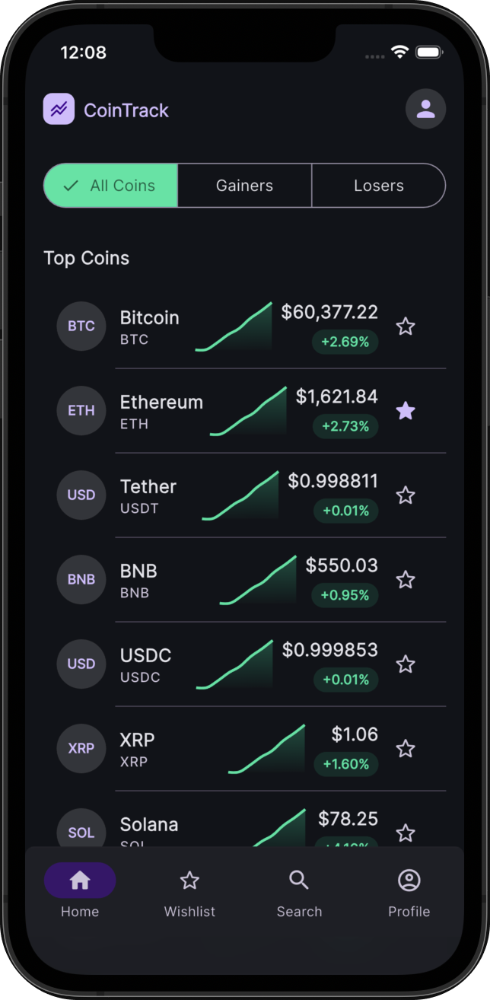
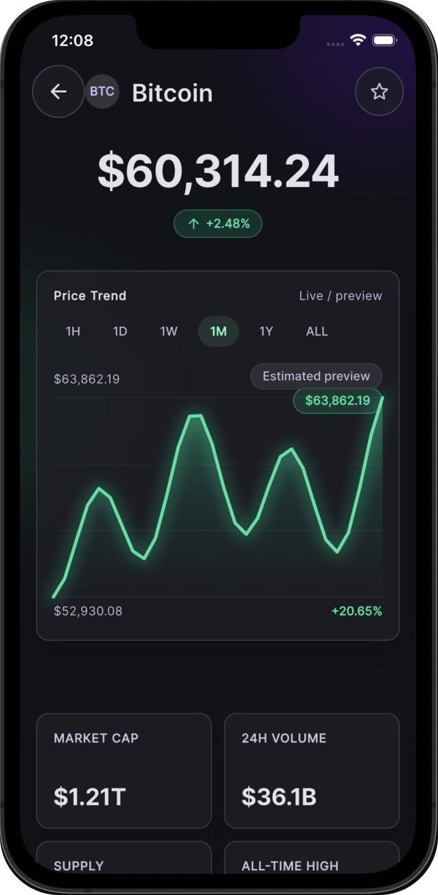
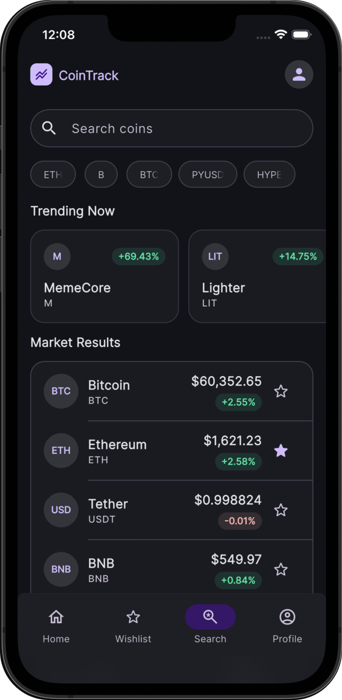
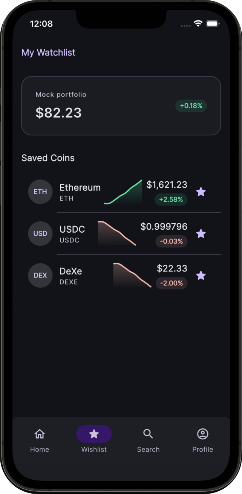

# CoinTrack

CoinTrack is a dark, mobile-first Flutter app for tracking cryptocurrency market data, exploring coin details, and saving favorite assets to a local watchlist.

The app uses CoinPaprika market data, Riverpod state management, and a custom Material 3 visual style with glassy cards, chart previews, and responsive loading/error states.

## Preview

Add your screenshots manually by replacing the image paths below.

| Home                                              | Coin Detail                                             | Search                                           | Watchlist                                             |
| ------------------------------------------------- | ------------------------------------------------------- | ------------------------------------------------ | ----------------------------------------------------- |
|  |  |  |  |

## Features

- Top cryptocurrency market list with gainers and losers filters
- Coin detail screen with price, change badge, chart, market stats, and about text
- Watchlist with local persistence using `shared_preferences`
- Search with recent searches and trending coins
- CoinPaprika API integration through `dio`
- Riverpod providers for API data, search, and watchlist state
- Dark Material 3 theme with custom colors and typography
- Mock chart/data fallback when live chart data is unavailable

## Tech Stack

- Flutter
- Dart
- Riverpod
- Dio
- CoinPaprika API
- fl_chart
- cached_network_image
- shared_preferences
- intl
- google_fonts

## Project Structure

project currently uses a simple layered Flutter architecture with Riverpod state management:


```text
lib/
  core/
    network/        API client setup
    theme/          colors, typography, app theme
    formatters.dart number/date formatting helpers
  models/           coin, ticker, OHLCV models
  providers/        Riverpod providers and notifiers
  screens/          app screens
  services/         CoinPaprika service layer
  widgets/          reusable UI components

